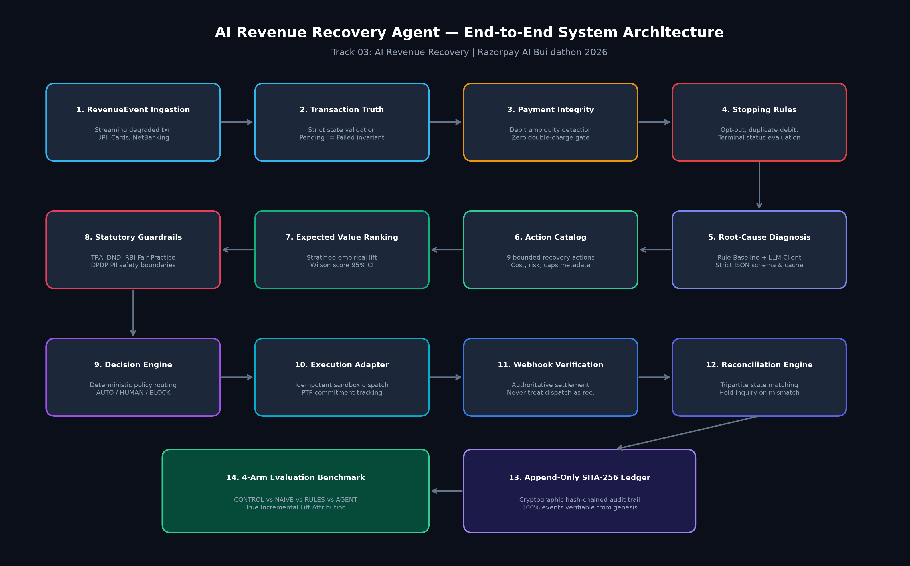

# AI Revenue Recovery Agent

> **Razorpay AI Buildathon 2026 — Track 03: AI Revenue Recovery**  
> 📌 **Quick Links:** [Start here for the 2-minute version](./EXECUTIVE_SUMMARY.md) | [Run it yourself in 5 minutes](./DEMO_RUNBOOK.md) | [5-Minute Pitch Script](./PITCH_VIDEO_SCRIPT.md) | [Live Dashboard (optional visualization)](https://akashknai04.github.io/revenue-recovery-dashboard/)  
> *The live dashboard is a read-only visualization of this repository's real, verified evaluation output (source: [revenue-recovery-dashboard](https://github.com/akashknai04/revenue-recovery-dashboard)). It uses a simulated sandbox engine, not a live payment integration. All logic, tests, and verification live in this repository.*  
> 💰 **Headline Result:** **Verified incremental recovery: ₹566,870.04 (+35.20% lift over control)**, 100% reproducible and ledger-traceable with zero safety violations.

---

**Headline numbers (Batch B, seed 2002, 100 cases):**

| Arm | Gross Recovery | Incremental Recovery | Lift | Duplicate Charges | Status |
|---|---:|---:|---:|---:|---|
| CONTROL | ₹428,676.08 | ₹0.00 | +0.00% | 0 | PASSED |
| NAIVE | ₹260,040.21 | −₹168,635.87 | −10.47% | **9** | **FAILED** |
| RULES | ₹770,418.91 | ₹341,742.83 | +21.22% | 0 | PASSED |
| **AGENT** | **₹995,546.12** | **₹566,870.04** | **+35.20%** | **0** | **PASSED** |

The overall run status is honestly reported as **FAILED**, because the NAIVE arm breached the duplicate-charge safety invariant — per Rule 7, this is surfaced, not hidden. It's included deliberately, as evidence the safety system correctly detects and reports unsafe behavior instead of only ever showing a clean result.

Every number above is reconstructable from the append-only, SHA-256 hash-chained ledger (761 events for this run) with no other data source required.

---

## 1. System Architecture & 14-Stage Pipeline



A bounded, auditable, and reproducible agent designed to detect degraded payments, diagnose failure root causes, select the safest economically-optimal recovery action (including tracking promise-to-pay commitments), execute solely via deterministic policy and hard safety guardrails, verify actual financial outcomes via authoritative webhooks, and report measured **incremental recovery** across a 4-arm benchmark with a full immutable audit ledger.

### Scope Boundaries

#### In Scope:
- Payment degradation detection and recovery (UPI, cards, net banking).
- Structured, JSON-only LLM root-cause diagnosis.
- Promise-to-pay (PTP) tracking (`pending`, `kept`, `broken`, `renegotiated`).
- Deterministic stopping rules and RBI/TRAI safety guardrails.
- Sandboxed payment gateway and webhook verification.
- Tripartite reconciliation (Customer debit vs. Gateway status vs. Merchant order state).
- 4-arm comparative evaluation (`CONTROL`, `NAIVE`, `RULES`, `AGENT`).
- Automated markdown/HTML batch reporting with hash-traceable metrics.
- (Phase 12 Stretch) Hinglish voice call recovery adapter with identical schemas and safety constraints.

#### Explicitly Out of Scope (Future Extensions):
- **Real Financial Movement**: Sandbox/simulated provider only.
- **Multi-Provider Routing**: Single sandbox adapter interface in MVP.
- **Portfolio-Level Allocation**: Case-by-case bounded evaluation only.
- **Checkout Abandonment Recovery**: Payment-stage degradation only.
- **Subscription/Dunning Recovery**: Recurring billing dunning is not in scope.
- **B2B Receivables / Invoice Chasing**: Consumer payment degradation only.
- **Complex Uplift Models (T-Learner, X-Learner, Doubly-Robust)**: Simple stratified lift with confidence intervals used for EV.
- **Direct LLM Tool/Execution Access**: LLM outputs structured diagnosis JSON only; execution is strictly deterministic.

---

## 2. Non-Negotiable Invariants

1. **No LLM Direct Action**: Diagnosis $\to$ Deterministic Policy $\to$ Guardrails $\to$ Execution.
2. **Ground Truth Isolation**: The agent's `core/` package never imports `simulator/ground_truth.py`.
3. **Append-Only Ledger**: History is immutable; past ledger events cannot be modified or deleted.
4. **Authoritative Verification**: Execution completion does NOT equal recovery; recovery requires verified webhooks.
5. **Fail-Closed Safety**: Any safety invariant violation aborts and marks the entire run `FAILED`.

---

## 3. Diagnosis Layer Architecture & Benchmark Disclosure

> **Important Disclosure on Diagnosis Layer & 4-Arm Lift Drivers:**  
> The current diagnosis layer in `llm/client.py` uses a deterministic local expert heuristic as a reliable, hermetic stand-in for the LLM interface (zero external model API calls). Because the root-cause diagnosis output is identical between the RULES arm and the AGENT arm for every case, the incremental lift difference observed between RULES (+21.22%) and AGENT (+35.20%) reflects downstream decisioning components (Expected Value ranking with Wilson score CI, contextual action selection, and statutory guardrail escalations like HUMAN_REVIEW for high-value orders), not differences in diagnosis quality.

---

## 4. LLM Integration Status

The LLM diagnosis layer (`llm/client.py`) runs a deterministic local diagnosis generator by design rather than making live external API calls to remote model providers (such as Anthropic, OpenAI, or a local Ollama instance).

### Rationale & Architectural Design Constraints
1. **Rule 6 Compliance (Hermetic Local Execution)**: All unit tests, integration tests, and benchmark evaluations must execute entirely locally with zero external API keys and zero outbound network dependencies.
2. **Bit-for-Bit Reproducibility**: Financial recovery benchmarking and counterfactual lift calculations require strictly deterministic, reproducible runs across repeated evaluations.
3. **Cost, Rate Limit, and Latency Elimination**: Production test suites and simulation batches execute in milliseconds without external quota limits, network latency spikes, or API billing costs.

### Swapping to a Live Model Provider
If connecting a live model provider (e.g. `claude-3-haiku` or `gpt-4o-mini`), **only `_generate_raw_diagnosis` in `llm/client.py` needs to change for production execution**. All surrounding validation, disk caching, retry fallback, and ledger audit logging consume the resulting `DiagnosisOutput` identically.

---

## 5. Evaluation Reports & Audit Trail
- **Automated Markdown Batch Report:** [`report/batch_report.md`](./report/batch_report.md)
- **Standalone HTML Report:** [`report/batch_report.html`](./report/batch_report.html)

---

## 6. Build & Review History

For the complete project lifecycle — the phase-by-phase build log (Phases 1–12), all rounds of post-build verification and correction, and the final verified-state summary — see [`PROGRESS.md`](./PROGRESS.md).

---

## Getting Started

```bash
# 1. Install dependencies
pip install -r requirements.txt

# 2. Run the full test suite
python -m pytest -v

# 3. Run the four-arm evaluation benchmark
python -m evaluation.runner --config config/experiment_configs/default_config.json --seed 2002

# 4. Trace a single case through the full pipeline
python -m pytest tests/test_end_to_end_pipeline.py -v -s
```

No external API keys or network access are required to run any part of this project.

For a guided walkthrough of five key capabilities (recoverable failure, ambiguous debit protection, promise-to-pay lifecycle, rules-vs-agent divergence, and the full batch benchmark), see [`DEMO_RUNBOOK.md`](./DEMO_RUNBOOK.md).
